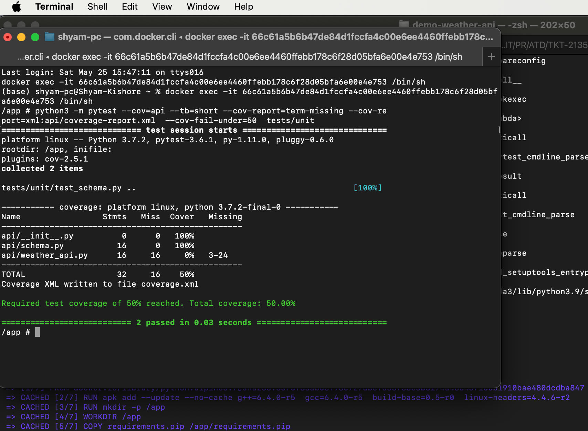

# Demo Weather API
***
This application requires docker to run locally. Refer to the installation docs [Docker Installation docs](https://docs.docker.com/install/) for installation:

### Running the Application Locally

Unzip the folder and change your working directory to the demo-weather-api
```sh
$ cd demo-weather-api
```
Then build the docker image using the following command:
```sh
$  docker build -t demo-api .
```
This will create an docker image locally. To run the application locally run the following command:
```sh
$ docker run -d -p 8080:8080 demo-api
```
The app will be running locally on port 8080, and then the enpoints can be accessed then

### Get the current weather of a specific location 
/api/v1/weather

#### Method
GET

#### URL Query Parameters
Parameter | Type | Mandatory | Default | Description
----------| ---- | -------- |---------| -----------
lat | Float | Yes | None | Lattitude of the location for which weather is to be found
lon | Float | Yes | None | Longitude of the location for which weather is to be found

### Response Sample
```json
{
    "data": {
        "base": "stations",
        "clouds": {
            "all": 0
        },
        "cod": 200,
        "coord": {
            "lat": 26.5298,
            "lon": 84.9109
        },
        "dt": 1716624019,
        "id": 1262710,
        "main": {
            "feels_like": 316.08,
            "grnd_level": 989,
            "humidity": 21,
            "pressure": 996,
            "sea_level": 996,
            "temp": 315.26,
            "temp_max": 315.26,
            "temp_min": 315.26
        },
        "name": "Mothīhāri",
        "sys": {
            "country": "IN",
            "sunrise": 1716593355,
            "sunset": 1716642341
        },
        "timezone": 19800,
        "visibility": 10000,
        "weather": [
            {
                "description": "clear sky",
                "icon": "01d",
                "id": 800,
                "main": "Clear"
            }
        ],
        "wind": {
            "deg": 134,
            "gust": 2.07,
            "speed": 3.03
        }
    },
    "status": "success",
    "status_code": 200
}
```

### Example Call
    curl --location --request GET 'http://127.0.0.1:8080/api/v1/weather?lat=26.529796&lon=84.910852'

  
### Get the weather forecast of a specific location 
/api/v1/forecast

#### Method
POST

#### URL Query Parameters
Parameter | Type | Mandatory | Default | Description
----------| ---- | -------- |---------| -----------
lat | Float | Yes | None | Lattitude of the location for which forecast is to be found
lon | Float | Yes | None | Longitude of the location for which forecast is to be found
cnt | Integer | No | 40 | Number of days for which forecast is requested
units | String | No | Standard | Longitude of the location for which forecast is to be found

### Response Sample
```json
{
    "data": {
        "base": "stations",
        "clouds": {
            "all": 0
        },
        "cod": 200,
        "coord": {
            "lat": 26.5298,
            "lon": 84.9109
        },
        "dt": 1716624019,
        "id": 1262710,
        "main": {
            "feels_like": 316.08,
            "grnd_level": 989,
            "humidity": 21,
            "pressure": 996,
            "sea_level": 996,
            "temp": 315.26,
            "temp_max": 315.26,
            "temp_min": 315.26
        },
        "name": "Mothīhāri",
        "sys": {
            "country": "IN",
            "sunrise": 1716593355,
            "sunset": 1716642341
        },
        "timezone": 19800,
        "visibility": 10000,
        "weather": [
            {
                "description": "clear sky",
                "icon": "01d",
                "id": 800,
                "main": "Clear"
            }
        ],
        "wind": {
            "deg": 134,
            "gust": 2.07,
            "speed": 3.03
        }
    },
    "status": "success",
    "status_code": 200
}
```

### Example Call
    curl --location --request POST 'http://127.0.0.1:8080/api/v1/forecast' \
    --header 'Content-Type: application/json' \
    --data-raw '{
        "lat": 26.529796,
        "lon": 84.910852,
        "units": "metric"
    }'

### Run Unit Test and Find Code Coverage

To find the test coverage of the application, you need run the command inside docker container. You can do it by following command:
```sh
$ docker run -it demo-api:latest /bin/sh
```
This will take you inside the container. To run the unit tests and get the coverage you need to run the command:
```sh
$ python3 -m pytest --cov=api --tb=short --cov-report=term-missing --cov-report=xml:api/coverage-report.xml  --cov-fail-under=50  tests/unit
```

Right now I wrote tests for just 1 file. Below is the coverage report!
